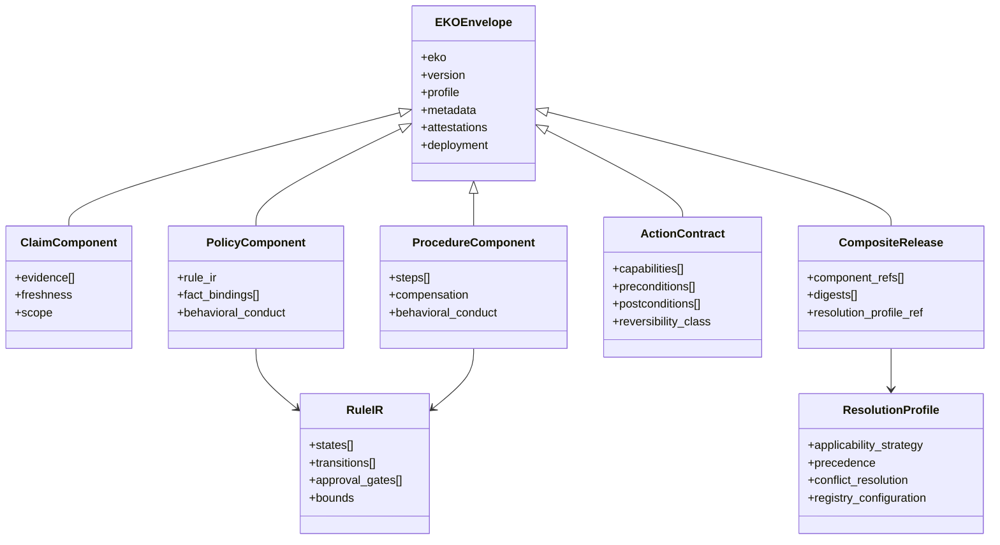
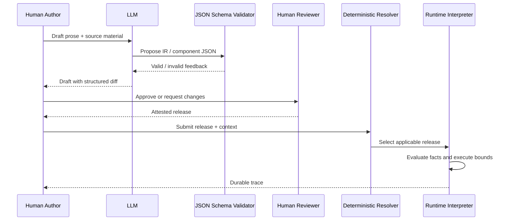

```mermaid
flowchart LR
    Human[Human author] --> Model[LLM translator]
    Model --> Draft[Draft component JSON]
    Draft --> Validate[Schema validation]
    Validate --> Review[Human review]
    Review --> Release[Attested EKO release]
    Release --> Resolver[Deterministic resolver]
    Resolver --> Interpreter[Pinned interpreter]
    Interpreter --> Trace[Durable execution trace]
```

# EKO Learning Path

A progressive tutorial to the `schemas/` architecture and the reasoning behind it.

**Audience:** A first-time visitor who needs to understand EKO without getting lost in JSON Schema.  
**Hands-on companion:** [`examples/seaway_cba/`](examples/seaway_cba/), an illustrative composite that validates against these schemas.

Status note: the schemas are **draft v0.1.0**. They define the release structure and important constraints, but they are not a complete interpreter specification.

---

## What this path covers

The lessons build from the EKO premise to the three schema files, then ground the design in the Seaway example. Each lesson begins with a practical question and ends with the key idea to carry forward.

Start with the axiom, then follow the profiles, release model, Rule IR, fact bindings, capabilities, and resolution model in order.

---

## Map of the territory

Three schema files. One job each.

```text
schemas/
  eko.schema.json                 ← WHAT is released (typed knowledge + envelope)
  rule-ir.schema.json             ← HOW domain control flow is declared (no eval)
  resolution-profile.schema.json  ← WHICH release wins when many apply
```

They exist because the design kept hitting the same failure modes: documents that cannot be tested, policies that pretend to be facts, agents that invent control flow, knowledge that grants itself power, and multi-policy enterprises with no deterministic winner.

The rest of this path shows how those failure modes shape the three files.

---

## Lesson 1: Why knowledge had to be redefined

**Question this lesson answers:** Why isn't a better knowledge base or a better RAG chunking strategy enough?

For decades, knowledge systems assumed a human reader. Humans bring background context, tolerate ambiguity, and fill gaps with judgment. Libraries of documents were enough.

That consumer is changing. An AI system arrives with the opposite profile: huge bandwidth, zero innate organizational context, high sensitivity to ambiguity, and the ability to act at machine speed.

Von Neumann put *instruction* on one side of a line and *data* on the other. Engineering discipline followed the instruction side: versioning, review, tests, deploy, rollback. Generative AI moves the risk. In an LLM-based system, the model is a general-purpose interpreter; the corpus it retrieves at runtime helps determine the program. What the system *does* is determined by knowledge, not only by application source code.

**Key takeaway:** EKO treats the knowledge that guides AI as an instruction layer that needs the discipline normally reserved for code.

The rest of the architecture follows from that shift.

---

## Lesson 2: The axiom (one sentence that loads the whole schema)

**Question:** What is the unit we are managing?

> **Knowledge is governed, context-sensitive information that connects evidence about the world to correct behavior within a defined scope.**

Every word becomes structure later:

| Word in the axiom | What it forces into the schema |
|---|---|
| Governed | owner, version, attestations, lifecycle, deployment, rollback |
| Context-sensitive | applicability / static scope + dynamic predicates |
| Information | evidence, sources, freshness |
| Connects evidence to behavior | rule IR + action contracts, not prose alone |
| Correct behavior | profile-appropriate tests (Corollary 2: unevaluable "knowledge" is opinion) |
| Defined scope | boundaries, abstain/escalate, conflict handling |

Three consequences drive the profile design:

1. Knowledge is more than what is true (facts alone are not enough).
2. Knowledge that cannot be evaluated is not knowledge.
3. **Truth and authority are different accountabilities:** empirical claims answer to the world; policies answer to an enacting authority.

Corollary 3 is why EKO refuses a single mushy "knowledge object" type. That refusal becomes Lesson 4.

---

## Lesson 3: The executability ladder (why documents fail)

**Question:** Why not keep policies as articles and let the model interpret them?

Trace one example up the ladder:

| Level | Example | What it can do |
|---|---|---|
| Data | `73°F` | Nothing alone |
| Content | "The server room is 73°F." | Inform a human |
| Knowledge | "If the room exceeds 85°F, alert facilities, because equipment degrades." | Connect condition → consequence → reason |
| Instruction | Explicit steps, prohibitions, escalation, tool bindings | Govern agent behavior |

The progression is **executability**, not volume. A refund policy in production is simultaneously a number, customer-facing copy, a decision rule, a behavioral constraint, and a request to call a payments API. Documents force those apart. EKO holds them in one *governed release* while letting different authorities approve different pieces.

**Key takeaway:** RAG retrieves content. EKO releases instruction. Retrieval can help discovery; it cannot be the authority.

---

## Lesson 4: Why five profiles exist

**Question:** Why `claim | policy | procedure | action_contract | composite` instead of one type?

Because treating everything as the same object dilutes accountability.

| Profile | What it is | Validated by | Conflicts resolved by |
|---|---|---|---|
| `claim` | Empirical assertion with sources | Verification, freshness, falsification | Claim adjudication; unresolved contradiction may be preserved |
| `policy` | Normative rule enacted by authority | Authority, scope, enactment provenance | Precedence (resolution profile) |
| `procedure` | Declared sequence toward an outcome | Behavioral tests, dry-run | Explicit supersession / release pinning |
| `action_contract` | Binding to a real-world capability | Contract tests, security review | Capability scoping |
| `composite` | Release that assembles the above | Release admission + integration tests | Manifest pinning |

In `eko.schema.json`, `profile` is an enum, and `allOf` conditionals force the matching `component` shape. A help-center fact is a `claim` and never needs a behavior test suite. A refund policy is typically a `composite` that pins a `policy`, presentation/evidence, and an `action_contract`.

**Key takeaway:** One schema supports graded rigor. Policies are not fact-checked, and observations are not enacted.

A quick pass through the file should reveal:

- top-level required fields: `eko`, `version`, `profile`, `metadata`
- the `profile` enum
- `$defs/claim_component` vs `$defs/policy_component`

That is Lesson 4 made concrete.

---

## Lesson 5: Why there are three schema files (not one mega-schema)

**Question:** Why split Rule IR and Resolution Profile out of `eko.schema.json`?

Because they answer different questions and change on different cadences.

```text
                    ┌─────────────────────────────┐
   Author / review  │  eko.schema.json            │  "What am I releasing?"
                    │  identity, profile,         │
                    │  evidence, facts, tests,    │
                    │  attestations, deployment   │
                    └─────────────┬───────────────┘
                                  │ embeds / refs
                    ┌─────────────▼───────────────┐
   Domain logic     │  rule-ir.schema.json        │  "What control flow is allowed?"
                    │  states, transitions,       │
                    │  approvals, action refs     │
                    └─────────────┬───────────────┘
                                  │ selected under
                    ┌─────────────▼───────────────┐
   Multi-EKO world  │  resolution-profile.schema  │  "Which release governs this case?"
                    │  applicability, precedence, │
                    │  conflict, registry         │
                    └─────────────────────────────┘
```

- **EKO envelope** = the unit of deployment (like a signed release).
- **Rule IR** = the unit of domain control flow (like a constrained AST).
- **Resolution profile** = the unit of multi-policy combination (like XACML combining algorithms, scoped per domain/jurisdiction).

Policies *reference* a resolution profile; they do not redefine the resolver. That separation exists because "precedence policy is itself knowledge" would recurse forever without a trust root (Lesson 10).

### UML snapshot: how the three schema files relate



The diagram shows accountability boundaries, not every field.

---

## Lesson 6: The release model (the git synthesis)

**Question:** Why not one big mutable knowledge object?

One large mutable object creates **false atomicity**. Legal changes the rule; communications changes the customer copy; security approves the tool binding. Those evolve at different rates and are approved by different people.

EKO uses a release model analogous to git:

- Components are immutable, content-addressed, independently versionable.
- The EKO **release** is a signed manifest that pins specific component hashes (and the interpreter).
- Deployment, canary, rollback, and audit operate on releases, not on live mutation of a document.

In the draft schemas, the `composite` profile makes this visible through component references, digests, and a compatibility matrix (see [`examples/seaway_cba/seaway-cba.composite.json`](examples/seaway_cba/seaway-cba.composite.json)).

```text
composite release
  ├─ claim@1.0.0     sha256:…
  ├─ policy@1.0.0    sha256:…
  ├─ procedure@1.0.0 sha256:…
  ├─ action_contract@1.0.0 sha256:…
  └─ resolution profile pin
```

Current draft limitation: v0.1 captures the release envelope and component digests. Evidence snapshots, source-to-IR maps, behavior hashes, and a deployment registry are not yet encoded as schema fields.

**Key takeaway:** Atomicity of change lives at the release; independence of approval lives at the component.

---

## Lesson 7: Rule IR: knowledge as code-as-data

**Question:** Why a state machine IR instead of "the LLM follows the policy prose"?

Because "code as data" implies a serialized program whose semantics exist only through a specific interpreter, not prose the model informally follows.

```text
Knowledge Object (immutable, typed declarative program)
  + runtime facts and authorized capabilities
  + interpreter version
  → validated workflow instance
  → durable execution trace
```

`rule-ir.schema.json` is the deliberately small DSL:

- **States:** `decision | action | approval | terminal | error | escalation`
- **Transitions:** conditional edges (predicates)
- **Action references:** capability/procedure invocations, not implementations
- **Approval gates:** human / automated / hybrid
- **Bounds:** timeouts, cycle detection

What it deliberately refuses:

- arbitrary code / `eval`
- inventing new domain transitions at runtime
- owning retry/idempotency physics (those are runtime invariants)

**Domain vs runtime split** (load-bearing):

| Knowledge owns | Runtime owns |
|---|---|
| Applicability, branching, required steps | Condition evaluation, scheduling |
| Allowed actions, escalation paths | Authorization enforcement, approvals |
| Reversibility *class* and remediation *intent* | Idempotency, leases, timeouts, compensation *execution* |

**Key takeaway:** Knowledge declares domain behavior. The runtime enforces execution mechanics and authorization.

A quick look at `rule-ir.schema.json` should reveal `state.type` and `action_reference`. A policy example's embedded `rule_ir` in Seaway overtime rules shows how that shape gets used.

---

## Lesson 8: Fact bindings and three-valued logic

**Question:** Why can't the IR just read "the order age" from context?

Because impeccably auditable wrong behavior is still wrong. Runtime inputs are not trusted by default.

Every predicate input needs a **fact binding**: name, source, type, and `on_unknown` behavior (`ask | abstain | refuse | escalate | …`).

Evaluation is three-valued: `true | false | unknown`. Unknown is never silently coerced into a branch.

The ordering preserves a clear boundary between deciding which release applies and executing that release:

1. Static scope against the trusted invocation envelope → candidates  
2. Acquire applicability facts using candidate bindings  
3. Evaluate dynamic applicability (unknown candidates can force `indeterminate`)  
4. Apply precedence → select release(s)  
5. Only then acquire execution-only facts for the selected release  

In `eko.schema.json`, look at `$defs/fact_binding`. In Seaway, look at overtime `fact_bindings` and the `unknown-fact-abstain` test fixture.

**Key takeaway:** Missing facts are first-class outcomes. The system escalates, abstains, asks, or refuses; it does not invent.

---

## Lesson 9: Action contracts: declare capabilities, never grant them

**Question:** Why isn't "authorization_required: true" enough?

Because knowledge that can authorize itself is a privilege-escalation surface.

The boundary is explicit:

- The EKO **declares** required capabilities (e.g. `payments:refund`, `hr.grievance.file`).
- Enterprise IAM **grants** concrete, scoped, short-lived capabilities at **link** time.
- Tool interfaces, pre/postconditions, and reversibility class live on the `action_contract` profile.

Reversibility vocabulary (domain knowledge, not runtime physics):

| Class | Meaning |
|---|---|
| reversible | automatic inverse restores prior state |
| compensable | automatic compensating action restores a business invariant |
| reconcilable | automation contains the defect; a human must finish repair |
| irreversible | no supported restoration path |

**Key takeaway:** Knowledge may say that a refund may be issued. It cannot authorize itself to issue one.

`action_contract` in `eko.schema.json` and [`examples/seaway_cba/hr-capabilities.contract.json`](examples/seaway_cba/hr-capabilities.contract.json) make this boundary concrete.

---

## Lesson 10: Resolution profiles: many EKOs, one winner (or honest failure)

**Question:** What happens when two policies both apply?

Typed edges (`supersedes`, `exception_to`) are not enough. Enterprises need a deterministic combining mechanism whose *policy* can vary by domain, but whose *security semantics* cannot be rewritten by the knowledge itself.

`resolution-profile.schema.json` encodes:

- **Applicability strategy:** static scope, dynamic predicate, or hybrid
- **Precedence:** priority, temporal, hierarchical, or composite
- **Conflict resolution:** precedence wins, merge, escalate, deny all, …
- **Fact resolution:** source priority, unknown propagation, stale handling
- **Registry configuration:** where the authoritative candidate set comes from

Invariant resolver outcomes: `resolved | not_applicable | indeterminate | conflict`.

**Behavior of a selected release starts only after selection.** On `conflict` or resolution-level `indeterminate`, the **resolution profile** refuses and escalates, not whichever release almost won. There is no silent tie-breaking or global “lowest risk wins” rule.

Trust root that breaks recursion:

```text
platform trust root
  → enterprise governance charter
    → jurisdiction/domain resolution profiles
      → EKO releases
```

**Key takeaway:** Precedence is governed knowledge. The resolver is not. A program cannot rewrite its runtime protections from inside.

[`examples/seaway_cba/resolution-profile.json`](examples/seaway_cba/resolution-profile.json) demonstrates FLRA > CBA > agency guidance, temporal newest-wins, and conflict detection.

---

## Lesson 11: The crux: the model at both borders, citizen of neither

**Question:** Where is the LLM in this architecture?

**Knowledge is code-as-data. The language model appears on both sides of it, and never above it.**

```text
authoring:  human prose  →  model proposes IR + source map  →  deterministic validate
            →  human reviews source-to-IR diff  →  attested release

runtime:    model may retrieve candidates, elicit facts, render language
            →  deterministic resolver + interpreter own authority
            →  model never authors control flow that can act
```

Pipeline:

```text
governed EKO release
  + verified runtime facts
  + externally granted capabilities
  + pinned interpreter
  → compile / link / instantiate
  → bounded execute
  → durable trace
```

The two historic failure modes this dissolves:

1. Hand-authored formalism nobody can maintain (classic rules/BPM)
2. Model-improvised behavior nobody can govern (naive agents)

**Key takeaway:** The model is a translator at the borders of knowledge, not the authority within it. Authority belongs to the governed release and its approved interpreter.

### UML snapshot: authoring and runtime boundaries



The sequence marks where the model can assist and where authority remains outside the model.

---

## Lesson 12: Explore the schemas with Seaway

The following walkthrough connects each schema concept to a concrete artifact.

1. Open [`schemas/README.md`](schemas/README.md): three files, ten concerns.
2. Open [`examples/seaway_cba/README.md`](examples/seaway_cba/README.md): five profiles in one family.
3. Open `unit-recognition.claim.json`: claim + evidence, no rule IR required.
4. Open `overtime-rules.policy.json`: policy + `fact_bindings` + embedded `rule_ir`.
5. Open `grievance-procedure.json`: procedure steps + capability refs.
6. Open `hr-capabilities.contract.json`: declared capability, not a grant.
7. Open `resolution-profile.json`: how overlaps resolve.
8. Open `seaway-cba.composite.json`: the release that pins digests together.
9. Skim `tests/unknown-fact-abstain.fixture.json` and `tests/overtime-eligible.fixture.json`: evaluation is part of the knowledge.

To validate the example locally:

```bash
# From the repository root, with a JSON Schema 2020-12 validator installed.
jsonschema -i examples/seaway_cba/overtime-rules.policy.json schemas/eko.schema.json
jsonschema -i examples/seaway_cba/resolution-profile.json schemas/resolution-profile.schema.json
```

Together, these files show the architecture as concrete JSON.

---

## Lesson 13: How design pressures appear in the schema

Each field answers a specific governance or execution concern.

| Design pressure | Where it landed |
|---|---|
| Truth ≠ authority | `profile` enum + per-profile `component` |
| False atomicity of one big object | `composite` + digests; release-level deploy |
| Knowledge deploys like code | `deployment`, attestations, version, tests |
| Runtime inputs untrusted | `fact_binding` + `on_unknown` |
| No self-granted authority | `action_contract` capabilities declared only |
| LLM must not invent control flow | `rule-ir.schema.json` constrained states |
| Multi-policy enterprises | `resolution-profile.schema.json` |
| Conflict ≠ IR bug | Resolver `conflict` vs execution `indeterminate`; draft schemas use conflict and escalation enums. |
| Behavior only after selection | Resolution-profile failure handling; selected release `behavioral_conduct`. |
| Reproducible execution | `interpreter` pin on the EKO |
| Evaluation is constitutive | top-level `tests` + fixture types |
| Authoring burden | out of schema scope; humans approve IR diffs |

---

## Lesson 14: Summary

EKO can be summarized in six ideas:

1. **Premise:** The model is the interpreter; enterprise knowledge is the program. Discipline must move with the danger.
2. **Unit:** An EKO is governed, scoped instruction that connects evidence to testable behavior.
3. **Shape:** Five profiles make claims, policies, procedures, and tool contracts accountable in different ways. Releases pin immutable components like git tags pin commits.
4. **Execution:** A small Rule IR declares control flow without `eval`. Facts are contracted, capabilities are declared and granted externally, and many policies resolve through a governed resolution profile.
5. **Model boundary:** A model can propose IR at authoring time and help at the edges at runtime. Authority stays in the governed release and approved interpreter.
6. **Concrete form:** The schemas and Seaway example express the model in machine-readable form, including an unknown-fact fixture.

---

## What the schemas do *not* fully encode yet

Draft v0.1.0 has clear limits:

- Predicate expressions are strings; a formal expression AST and truth tables are not yet part of JSON Schema.
- Attestation cryptography, capability URI grammar, and compensation execution semantics are not yet fully specified.
- Workflow-instance and trace schemas are not separate JSON Schema files yet.
- Authoritative registry snapshot hashing and release-admission policy are not yet represented in `eko.schema.json`.

The schemas are a portable structural contract. A production implementation would require these additional semantics.

---

## Continue exploring

1. [`README.md`](README.md): repository framing and scope
2. [`schemas/README.md`](schemas/README.md): machine-readable contract
3. [`examples/seaway_cba/`](examples/seaway_cba/): concrete EKO family

---

## One-page concept map

```text
                    WHY (problem)
              von Neumann line moved
           knowledge is now the program
                        │
                        ▼
                 WHAT (axiom + profiles)
         governed, scoped, evidence → behavior
         claim | policy | procedure | contract | composite
                        │
          ┌─────────────┼─────────────┐
          ▼             ▼             ▼
   eko.schema     rule-ir.schema   resolution-profile
   release unit   domain control   multi-EKO winner
          │             │             │
          └─────────────┼─────────────┘
                        ▼
              HOW (runtime boundary)
     facts earned · capabilities linked · interpreter pinned
     model translates at borders · authority in attested artifact
                        ▼
              PROOF (examples + tests)
                 seaway_cba family
```

The diagram summarizes how the premise becomes a release model, schema files, and concrete examples.

## UML view

This deployment-oriented view summarizes the lifecycle from prose to governed execution:



The flowchart highlights the handoffs among authoring, validation, review, resolution, and execution.
