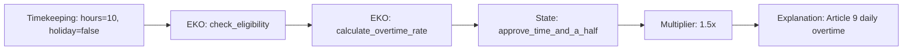
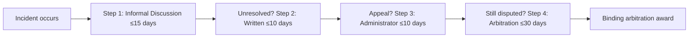
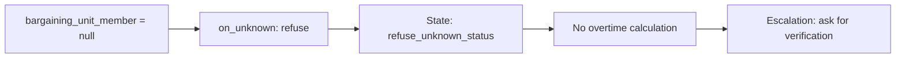

# Seaway AFGE CBA EKO Family

An illustrative, schema-valid conversion showing how a Collective Bargaining Agreement can be represented as governed, testable Executable Knowledge Objects. It is not an approved interpretation of the agreement and does not represent an SLSDC, AFGE, or FLRA release.

## Overview

This example converts the **Saint Lawrence Seaway Development Corporation (SLSDC) & AFGE Local 1968 Collective Bargaining Agreement** (effective June 20, 2016 – September 30, 2018) into a canonical EKO Family covering:

- **Bargaining unit recognition** (Article 1)
- **Overtime distribution rules** (Articles 9 & 10)
- **Grievance and arbitration procedures** (Article 15)
- **HR capability contracts** for grievance filing
- **Resolution profile** for precedence and conflict handling

The artifacts validate locally against the draft schemas in [`../../schemas/`](../../schemas/). The behavioral fixtures are expected outcomes for a future pinned interpreter, not executed runtime tests.

---

## Component Files

| File | Profile | Description | Status |
|------|---------|-------------|--------|
| [`unit-recognition.claim.json`](unit-recognition.claim.json) | `claim` | Bargaining unit scope and eligibility, grounded in Article 1. | Draft example |
| [`overtime-rules.policy.json`](overtime-rules.policy.json) | `policy` | Daily and holiday overtime rules under Articles 9 and 10. | Draft example |
| [`grievance-procedure.json`](grievance-procedure.json) | `procedure` | Four-step grievance and arbitration workflow under Article 15. | Draft example |
| [`hr-capabilities.contract.json`](hr-capabilities.contract.json) | `action_contract` | Bounded `hr.grievance.file` interface with compensation fallback. | Draft example |
| [`resolution-profile.json`](resolution-profile.json) | *Resolution* | Precedence, temporal validity, and conflict-handling rules. | Draft example |
| [`seaway-cba.composite.json`](seaway-cba.composite.json) | `composite` | Release envelope that pins compatible versions and content digests. | Draft example |

---

## Validation

### Schema Compliance

The EKO artifacts validate against `eko.schema.json`; the resolution profile validates against its dedicated schema:

```bash
# Run from the repository root.
jsonschema -i examples/seaway_cba/overtime-rules.policy.json schemas/eko.schema.json

jsonschema -i examples/seaway_cba/resolution-profile.json schemas/resolution-profile.schema.json
```

The commands exit successfully with zero validation errors.

### Content Digests

The composite release uses actual SHA256 content digests:

```bash
# Verify component digests
shasum -a 256 unit-recognition.claim.json overtime-rules.policy.json grievance-procedure.json hr-capabilities.contract.json resolution-profile.json
```

---

## Test Fixtures

Comprehensive test fixtures under [`tests/`](tests/) verify expected behavior:

| Test | Type | Description |
|------|------|-------------|
| [`overtime-eligible.fixture.json`](tests/overtime-eligible.fixture.json) | happy_path | Holiday work triggers 2.0x double-time |
| [`time-and-half.fixture.json`](tests/time-and-half.fixture.json) | happy_path | Daily overtime >8 hours triggers 1.5x |
| [`regular-rate.fixture.json`](tests/regular-rate.fixture.json) | happy_path | Hours ≤8 trigger regular rate |
| [`grievance-expired.fixture.json`](tests/grievance-expired.fixture.json) | edge_case | 20-day delay exceeds 15-day limit |
| [`grievance-step2-transition.fixture.json`](tests/grievance-step2-transition.fixture.json) | happy_path | Valid Step 1→Step 2 transition |
| [`unknown-fact-abstain.fixture.json`](tests/unknown-fact-abstain.fixture.json) | unknown_fact | Null status triggers refusal |
| [`stale-evidence.fixture.json`](tests/stale-evidence.fixture.json) | edge_case | Evidence older than freshness threshold |

### Running Tests

These fixtures are the behavioral specification. A runtime test runner is intentionally not included in this submission.

---

## Architecture Highlights

### 1. Profile Completeness

All five EKO profiles are represented:
- **claim**: Empirical assertions with evidence
- **policy**: Normative rules with rule IR
- **procedure**: Multi-step workflows with compensation
- **action_contract**: Capability security contracts
- **composite**: Release envelopes with pinned versions

### 2. Behavioral Conduct

Components include explicit behavioral constraints:
```json
"behavioral_conduct": {
  "required_explanations": [...],
  "prohibited_conduct": [...],
  "escalation_paths": [...]
}
```

### 3. Fact Bindings

Runtime facts are obtained through declared contracts:
```json
"fact_bindings": [
  {
    "name": "hours_worked_today",
    "source": "timekeeping.daily_hours",
    "type": "number",
    "on_unknown": "escalate",
    "escalation_target": "payroll_supervisor"
  }
]
```

### 4. Rule IR Embedding

Overtime policy embeds complete state machine:
```
check_eligibility → calculate_overtime_rate → [approve_double_time | approve_time_and_a_half | regular_rate]
```

### 5. Resolution Profile

Comprehensive precedence and conflict handling:
- Hierarchical authority (FLRA > CBA > Agency Guidance)
- Temporal ordering (newest wins with grace period)
- Conflict detection (overlapping scope, contradictory actions)

---

## Example Workflows

### Workflow 1: Overtime Calculation



### Workflow 2: Grievance Filing



### Workflow 3: Unknown Fact Handling



---

## Exit Criteria Status

| Criterion | Status | Evidence |
|-----------|--------|----------|
| Schema validation | Verified locally | All six artifacts validate with zero errors. |
| Behavioral execution | Not provided | Seven fixtures specify expected and failure outcomes for a future interpreter. |
| Traceability | Illustrative | Rules cite the agreement and its articles; legal fidelity has not been independently reviewed. |
| Interpreter pinning | Declared | EKO artifacts identify the intended interpreter version. |
| Attestations | Not claimed | No external approvals, signatures, or verifications are represented. |
| Content digests | Verified locally | The composite pins the SHA-256 digest of each component. |

---

## Source Document

- **File:** [`Seaway_AFGE_CBA.pdf`](Seaway_AFGE_CBA.pdf)
- **Parties:** Saint Lawrence Seaway Development Corporation (DOT) & AFGE Local 1968
- **Effective:** June 20, 2016 – September 30, 2018 (with annual renewal)

## Contributing

This example serves as reference material for EKO implementation. Suggestions for improvement should maintain:
- Schema compliance
- Evidence linkage to CBA articles
- Test fixture completeness
- Behavioral conduct explicitness
- Clear distinction between illustrative data and external approval

## License

This example is part of the EKO repository. See repository LICENSE for details.
