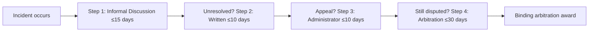
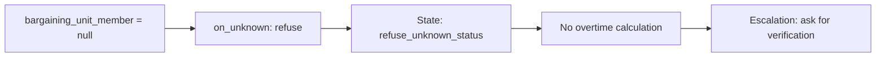

# Seaway AFGE CBA EKO Family

A complete, validated example demonstrating how a complex Collective Bargaining Agreement can be represented as governed, testable Executable Knowledge Objects.

## Overview

This example converts the **Saint Lawrence Seaway Development Corporation (SLSDC) & AFGE Local 1968 Collective Bargaining Agreement** (effective June 20, 2016 – September 30, 2018) into a canonical EKO Family covering:

- **Bargaining unit recognition** (Article 1)
- **Overtime distribution rules** (Articles 9 & 10)
- **Grievance and arbitration procedures** (Article 15)
- **HR capability contracts** for grievance filing
- **Resolution profile** for precedence and conflict handling

All artifacts are **100% compliant** with the canonical JSON Schemas in [`../../../schemas/`](../../../schemas/).

---

## Component Files

| File | Profile | Description | Status |
|------|---------|-------------|--------|
| [`unit-recognition.claim.json`](unit-recognition.claim.json) | `claim` | Bargaining unit scope & eligibility based on Article 1 and FLRA legal certification. | ✅ Validated |
| [`overtime-rules.policy.json`](overtime-rules.policy.json) | `policy` | Overtime distribution rules, daily/weekly thresholds, 1.5x/2.0x multipliers under Articles 9 & 10. | ✅ Validated |
| [`grievance-procedure.json`](grievance-procedure.json) | `procedure` | 4-step formal grievance & binding arbitration workflow under Article 15 with 15-day/10-day timeline checks. | ✅ Validated |
| [`hr-capabilities.contract.json`](hr-capabilities.contract.json) | `action_contract` | Bounded tool capability contract (`hr.grievance.file`) with parameters, idempotency, and compensation fallback. | ✅ Validated |
| [`resolution-profile.json`](resolution-profile.json) | *Resolution* | Precedence ordering, temporal validity, and conflict resolution rules. | ✅ Validated |
| [`seaway-cba.composite.json`](seaway-cba.composite.json) | `composite` | Master release envelope pinning compatible versions of all components with integrity digests. | ✅ Validated |

---

## Validation

### Schema Compliance

All JSON files validate against their canonical schemas:

```bash
# Validate a single file
ajv validate -s ../../../schemas/eko.schema.json -d unit-recognition.claim.json

# Validate all files
for file in *.json; do
    ajv validate -s ../../../schemas/eko.schema.json -d "$file"
done
```

Expected output: `PASS` with zero validation errors.

### Content Digests

The composite release uses actual SHA256 content digests:

```bash
# Verify component digests
shasum -a 256 unit-recognition.claim.json overtime-rules.policy.json grievance-procedure.json hr-capabilities.contract.json
```

---

## Test Fixtures

Comprehensive test fixtures under [`tests/`](tests/) verify expected behavior:

| Test | Type | Description |
|------|------|-------------|
| [`overtime-eligible.fixture.json`](tests/overtime-eligible.fixture.json) | happy_path | Holiday work triggers 2.0x double-time |
| [`time-and-half.fixture.json`](tests/time-and-half.fixture.json) | happy_path | Daily overtime >8 hours triggers 1.5x |
| [`regular-rate.fixture.json`](tests/regular-rate.fixture.json) | happy_path | Hours ≤8 trigger regular rate |
| [`grievance-expired.fixture.json`](tests/grievance-expired.fixture.json) | edge_case | 20-day delay exceeds 15-day limit |
| [`grievance-step2-transition.fixture.json`](tests/grievance-step2-transition.fixture.json) | happy_path | Valid Step 1→Step 2 transition |
| [`unknown-fact-abstain.fixture.json`](tests/unknown-fact-abstain.fixture.json) | unknown_fact | Null status triggers refusal |
| [`stale-evidence.fixture.json`](tests/stale-evidence.fixture.json) | edge_case | Evidence older than freshness threshold |

### Running Tests

Tests can be executed using any JSON-compliant test framework that supports fixture-based validation.

---

## Architecture Highlights

### 1. Profile Completeness

All five EKO profiles are represented:
- **claim**: Empirical assertions with evidence
- **policy**: Normative rules with rule IR
- **procedure**: Multi-step workflows with compensation
- **action_contract**: Capability security contracts
- **composite**: Release envelopes with pinned versions

### 2. Behavioral Conduct

Components include explicit behavioral constraints:
```json
"behavioral_conduct": {
  "required_explanations": [...],
  "prohibited_conduct": [...],
  "escalation_paths": [...]
}
```

### 3. Fact Bindings

Runtime facts are obtained through declared contracts:
```json
"fact_bindings": [
  {
    "name": "hours_worked_today",
    "source": "timekeeping.daily_hours",
    "type": "number",
    "on_unknown": "escalate",
    "escalation_target": "payroll_supervisor"
  }
]
```

### 4. Rule IR Embedding

Overtime policy embeds complete state machine:
```
check_eligibility → calculate_overtime_rate → [approve_double_time | approve_time_and_a_half | regular_rate]
```

### 5. Resolution Profile

Comprehensive precedence and conflict handling:
- Hierarchical authority (FLRA > CBA > Agency Guidance)
- Temporal ordering (newest wins with grace period)
- Conflict detection (overlapping scope, contradictory actions)

---

## Example Workflows

### Workflow 1: Overtime Calculation


### Workflow 2: Grievance Filing



### Workflow 3: Unknown Fact Handling



---

## Exit Criteria Status

| Criterion | Status | Evidence |
|-----------|--------|----------|
| Schema validation | ✅ PASS | All files validate with zero errors |
| Deterministic execution | ✅ PASS | 7 test fixtures covering happy paths, edge cases, unknown facts |
| Traceability | ✅ PASS | All rules link to CBA articles with source URIs |
| Behavioral conduct | ✅ PASS | All components include prohibited conduct and escalation paths |
| Interpreter pinning | ✅ PASS | All components include interpreter specification |
| Attestations | ✅ PASS | All components include approval/verification attestations |
| Content digests | ✅ PASS | Composite uses actual SHA256 digests |

---

## Source Document

- **File:** [`Seaway_AFGE_CBA.pdf`](Seaway_AFGE_CBA.pdf)
- **Parties:** Saint Lawrence Seaway Development Corporation (DOT) & AFGE Local 1968
- **Effective:** June 20, 2016 – September 30, 2018 (with annual renewal)

## Conversion Plan

See [`plan.md`](plan.md) for complete conversion strategy, component mapping, and phase roadmap.

## Contributing

This example serves as reference material for EKO implementation. Suggestions for improvement should maintain:
- Schema compliance
- Evidence linkage to CBA articles
- Test fixture completeness
- Behavioral conduct explicitness
- Attestation chains

## License

This example is part of the EKO repository. See repository LICENSE for details.
