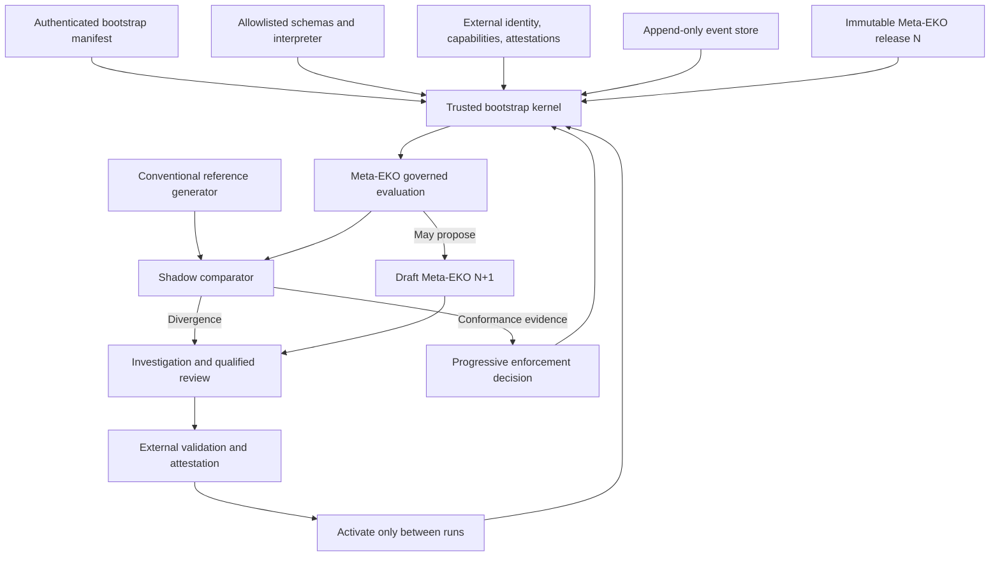
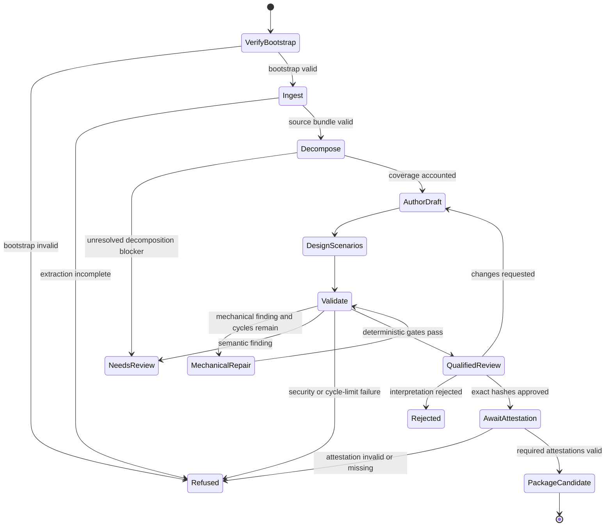

# Proposal: EKO-Governed Generator — Shadow-to-Enforcement Bootstrap

Status: architecture proposal; not implemented; not validated

## 1. Executive summary

This document proposes governing the EKO generator with EKO artifacts after a minimal trusted runtime and conventional reference generator already exist.

The purpose is dogfooding: the generator is a demanding domain involving untrusted documents, model-assisted interpretation, deterministic validation, human review, external authority, packaging, and audit. Representing those rules as an EKO family can test whether EKO is expressive and useful beyond business-policy examples.

This is not literal self-creation or self-authorization. The Meta-EKO does not create its interpreter, grant its capabilities, attest itself, or activate its successor. It operates under a non-recursive trust root implemented as ordinary code and external authority systems.

The intended progression is:

```text
trusted bootstrap kernel
  + conventional reference generator
  -> Meta-EKO draft
  -> conformance testing
  -> shadow evaluation
  -> external review and attestation
  -> progressive enforcement
```

The Meta-EKO may govern a generator run only after it has earned that role. Schema validity alone is never sufficient.

The governed pipeline is defined in [`generator-agent-proposal.md`](generator-agent-proposal.md). The authoring-fidelity evaluation is [Experiment 002](../experiments/002-prose-to-ir-fidelity/DESIGN.md), and runtime-boundary testing is [Experiment 004](../experiments/004-runtime-boundaries/DESIGN.md).

## 2. Core thesis

> **If EKO can faithfully govern its own authoring pipeline from an external trust root, it provides a demanding dogfood test of its applicability to AI-assisted software workflows.**

Successful dogfooding would demonstrate that the current EKO model can represent and constrain this particular pipeline. It would not prove that EKO is universal, production-ready, or suitable for every software or policy domain.

## 3. Non-recursive trust model

Bootstrapping requires a layer that the Meta-EKO cannot redefine from inside itself.

### 3.1 Trusted bootstrap kernel

The kernel is ordinary, reviewable code responsible for:

- Loading a specific immutable Meta-EKO release by digest.
- Verifying schema and artifact identifiers against an allowlisted local registry.
- Interpreting only a frozen, documented Rule IR subset.
- Enforcing transition, cycle, timeout, approval, and capability invariants.
- Validating externally issued capabilities.
- Verifying authenticated review and attestation records.
- Persisting an append-only execution trace.
- Failing closed when required artifacts, authority, or trace persistence are unavailable.
- Activating a new Meta-EKO release only between runs and only after external authorization.

The kernel's executable, configuration, schema registry, interpreter semantics, trust anchors, and startup release digest form the **bootstrap manifest**. That manifest is reviewed and authenticated outside EKO.

### 3.2 External authority systems

External systems establish:

- Reviewer identity.
- Institutional roles and delegated scopes.
- Approval and attestation validity.
- Capability grants.
- Release activation permission.
- Revocation and rollback authorization.

An EKO can declare that a capability or approval is required. It cannot issue that capability or approve itself.

### 3.3 Active-release immutability

Meta-EKO release `N` may govern one or more generator runs and may cause a draft proposal for `N+1` to be created. It may not:

- Modify its own active bytes.
- Change the interpreter or trust anchors that enforce it.
- Approve or attest `N+1`.
- Activate `N+1` during the run that produced it.
- Suppress the trace of its own execution.
- Remove an externally mandated review or refusal gate.

Release `N+1` becomes eligible for a later run only after independent validation, external review, authenticated attestations, and bootstrap-kernel activation.

## 4. System architecture



The conventional reference generator and Meta-EKO evaluation receive the same governed facts in shadow mode. The reference implementation remains authoritative until promotion criteria are met.

## 5. Relationship to the generator architecture

The Meta-EKO must govern the seven-stage pipeline in [`generator-agent-proposal.md`](generator-agent-proposal.md), not the obsolete five-stage schema-only workflow.

| Generator stage | Meta-EKO concern | Required outcome |
|---|---|---|
| 1. Deterministic source ingestion | Procedure, source-integrity policy, action contract | Immutable source bundle or explicit ingestion failure |
| 2. Clause decomposition | Procedure and coverage policy | Clause ledger, complete accounting, unresolved questions |
| 3. EKO proposal authoring | Procedure, capability declaration, conduct constraints | Draft components plus source maps and ambiguity reports |
| 4. Independent scenario design | Procedure and independence policy | Source-derived fixtures and oracle notes |
| 5. Deterministic validation ladder | Quality policy and validator contracts | Gate reports without claims of authority |
| 6. Qualified review and attestation | Approval states and external authority requirements | Hash-bound decisions and authentic attestations |
| 7. Deterministic release packaging | Packaging procedure and integrity policy | Signed or explicitly unsigned release candidate |

The Meta-EKO governs transitions and requirements. The bootstrap kernel owns execution invariants such as persistence, authorization checks, idempotency, timeout enforcement, and trace durability.

## 6. Meta-EKO component model

The mapping is compositional, not “one of every profile.” A component exists only when its accountability is needed.

### 6.1 Generator procedure

`generator-pipeline.procedure.json` declares:

- The seven generator stages.
- Required order and dependencies.
- Preconditions for each stage.
- Mechanical-remediation transitions.
- Qualified-review transitions.
- Refusal and escalation states.
- Packaging eligibility as distinct from release approval.
- Compensation or reconciliation intent where a tool stage has side effects.

The procedure does not implement parsers, models, validators, event persistence, retries, or signing.

### 6.2 Generator quality policy

`generator-quality.policy.json` declares the facts and conditions required to move between lifecycle states.

Minimum quality facts include:

| Fact | Source | Required behavior |
|---|---|---|
| `source_extraction_complete` | Deterministic ingestion report | False or unknown blocks authoring |
| `normative_clause_coverage` | Coverage validator | Must meet the frozen threshold |
| `unsupported_ir_count` | Source-map validator | Nonzero blocks semantic approval |
| `unresolved_ambiguity_count` | Ambiguity report | Nonzero requires qualified disposition |
| `schema_error_count` | Pinned schema validator | Nonzero permits mechanical remediation only |
| `reference_error_count` | Reference validator | Nonzero blocks progression |
| `ir_invariant_error_count` | Rule IR validator | Nonzero blocks scenario execution |
| `scenario_failure_count` | Scenario runner | Nonzero requires investigation |
| `high_security_failure_count` | Security harness | Nonzero fails closed |
| `required_reviews_complete` | External review system | False or unknown blocks attestation |
| `required_attestations_valid` | External verifier | False or unknown blocks packaging as released |
| `approved_hashes_match` | Deterministic packager | False blocks packaging |

The policy may produce outcomes such as:

- `mechanical_repair_allowed`
- `semantic_review_required`
- `institutional_action_required`
- `eligible_for_review`
- `eligible_for_attestation`
- `eligible_for_packaging`
- `refused`
- `indeterminate`

It must not emit an institutional approval merely because validation counts are zero.

### 6.3 Generator action contracts

Action contracts declare interfaces and required capabilities for:

- PDF extraction.
- OCR.
- Clause decomposition.
- Draft authoring.
- Independent scenario generation.
- Schema and reference validation.
- IR invariant checking.
- Scenario execution.
- Review-package generation.
- Digest computation.
- Attestation verification.
- Release packaging.

These contracts describe required authority and tool boundaries. Concrete, scoped grants are issued by the external capability system at link or execution time.

No action contract may grant:

- Production deployment.
- Signature authority.
- Approval authority.
- Arbitrary shell execution.
- Unbounded file-system access.
- Unrestricted network access.
- Mutation of the active Meta-EKO release.

### 6.4 Generator claims

Claims are optional. They are appropriate only for empirical assertions such as:

- A specific validator build supports the required JSON Schema vocabulary.
- A parser build produced a stated extraction result for a fixed fixture.
- A runtime build passed a named conformance suite.

Claims require evidence, source identifiers, timestamps, and verification methods. Marketing assertions such as “production-grade” or “universal” are not generator claims.

### 6.5 Composite release

`eko-generator.composite.json` pins:

- Generator procedure.
- Quality policies.
- Action contracts.
- Optional claims.
- Separate resolution profile when one is required.
- Scenario and conformance suite version.
- Schema versions.
- Interpreter semantics and implementation identity.
- Component digests.
- Required external attestations.
- Deployment mode: `shadow` or a specific enforcement level.

The composite identifies the governed configuration. It does not become authoritative merely by containing valid hashes.

### 6.6 Resolution profile

A generator resolution profile is a separate governed artifact, not an EKO profile. It may define which governance release applies by environment, generator version, document class, or rollout cohort.

Its trust anchor and parent constraints remain external to the profile. It cannot redefine bootstrap-kernel security semantics.

## 7. Governed workflow

The conceptual state flow is:



`PackageCandidate` means that the run produced a package eligible under the configured governance rules. Actual release activation remains an external action.

## 8. Remediation boundaries

The Meta-EKO may govern bounded remediation, but it must preserve the distinction among three finding classes.

### Mechanical

Examples:

- Invalid JSON.
- Missing structurally required field.
- Invalid enum.
- Broken reference caused by an identifier rename.
- Incorrect digest encoding.

Automatic repair is permitted only when:

- No source-dependent value is invented.
- The active release remains immutable.
- Input and output hashes are recorded.
- Source mappings remain valid.
- The remediation-cycle bound has not been reached.

### Semantic

Examples:

- Missing exception.
- Unsupported transition.
- Changed threshold.
- Widened scope.
- Ambiguous unknown behavior.
- Conflicting source clauses.

These findings require a new draft and qualified source-aware review. They are not self-healed.

### Institutional

Examples:

- Missing authority.
- Invalid delegation.
- Missing reviewer.
- Absent or revoked attestation.
- Deployment not authorized.

These findings leave the model pipeline and must be resolved by external accountable actors or systems.

The Rule IR schema can validate the shape of a cycle bound such as `max_iterations`. Only the bootstrap kernel can enforce it at runtime.

## 9. Shadow-to-enforcement progression

### Mode 0: Off

The conventional generator runs without Meta-EKO evaluation. This mode establishes reference behavior and allows the bootstrap kernel to be tested independently.

### Mode 1: Observe

The Meta-EKO receives a replayable copy of facts and events but cannot block, approve, invoke side effects, or change the reference run.

Measure:

- Fact availability.
- Trace completeness.
- Unsupported semantics.
- Runtime and storage overhead.

### Mode 2: Shadow

The conventional generator and Meta-EKO independently calculate transition and gate outcomes from the same inputs.

Record:

- Outcome agreement.
- Divergence category.
- False refusal and false progression.
- Missing fact or authority dependencies.
- Explanation and trace differences.

No Meta-EKO outcome controls the run.

### Mode 3: Advisory

The Meta-EKO may emit non-binding warnings, review requests, and packaging recommendations. The conventional system remains authoritative.

### Mode 4: Mechanical enforcement

The Meta-EKO may block on narrow deterministic findings such as:

- Invalid bootstrap artifacts.
- Schema or reference failure.
- Resource or cycle-limit violations.
- Digest mismatch.
- Missing durable trace.

It may not approve semantic interpretation or release activation.

### Mode 5: Governance enforcement

After external approval and sufficient shadow evidence, the Meta-EKO may enforce source-coverage, semantic-review, attestation, and packaging-eligibility gates.

External systems still own reviewer identity, capability issuance, attestation, activation, rollback, and revocation.

Promotion between modes requires a separately approved bootstrap-manifest change or deployment event. The active Meta-EKO cannot promote itself.

## 10. Conformance and promotion criteria

Before leaving shadow mode:

- The bootstrap kernel passes its independent conformance and security suite.
- The Meta-EKO uses only the frozen supported IR subset.
- The same pinned inputs produce the same deterministic Meta-EKO outcome and trace.
- Every divergence against the reference implementation is classified and adjudicated.
- No confirmed unsafe false progression remains.
- False refusal remains below the preregistered operational ceiling.
- Trace completeness meets the frozen requirements.
- Capability-denial, approval-bypass, artifact-substitution, prompt-injection, and self-modification tests pass.
- Qualified reviewers approve the exact Meta-EKO component hashes.
- External attestations bind those hashes to explicit scopes.
- Rollback to the prior signed release is tested.

The comparison should distinguish:

- Reference implementation bug.
- Meta-EKO specification bug.
- Bootstrap-kernel implementation bug.
- Missing or differently bound fact.
- Genuine policy ambiguity.
- Test or oracle defect.

A divergence is evidence to investigate, not proof that either side is automatically correct.

## 11. Version and self-modification protocol

### Proposing a successor

During a run governed by release `N`:

1. A tool may generate a draft of `N+1`.
2. The draft is stored outside the active release directory.
3. The current run records the proposal event and draft hash.
4. Release `N` continues unchanged until the run terminates.

### Approving a successor

After the run:

1. Deterministic validators evaluate `N+1`.
2. The successor runs against conformance and historical replay suites.
3. It runs in shadow mode against the current release.
4. Qualified reviewers inspect source and behavioral diffs.
5. External authorities attest exact successor hashes.
6. The bootstrap manifest schedules `N+1` for a future run.

### Activating and rolling back

- Activation occurs only at a clean run boundary.
- The previous signed release remains available as rollback target.
- A failed startup verification leaves the previous release active or fails closed according to bootstrap policy.
- Emergency rollback is an external signed event, not a transition authored by the failing release.
- Revocation is checked before each activation and at configured runtime boundaries.

## 12. Trace requirements

Every governed run records:

- Bootstrap-manifest digest.
- Kernel and interpreter build identity.
- Active Meta-EKO release and component digests.
- Schema and resolution-profile versions.
- External capabilities and approval events used.
- Source-document and source-bundle digests.
- Bound facts with verification and freshness status.
- Each evaluated transition and gate.
- Remediation input/output hashes and finding class.
- Model, prompt, parser, validator, and packager identifiers.
- Reference-generator outcome in shadow mode.
- Divergences and their dispositions.
- Packaging result.
- Proposed successor hashes.
- Activation, rollback, and revocation events.

The Meta-EKO cannot suppress required trace fields. If durable recording is unavailable for a consequential transition, the kernel fails closed.

## 13. Proposed repository structure

```text
generator/
├── generating-eko.md
├── generator-agent-proposal.md
├── eko-generator-bootstrapping-proposal.md
├── bootstrap/
│   ├── README.md
│   ├── bootstrap-manifest.schema.json
│   ├── trusted-kernel-config.example.json
│   └── trust-anchors.example.json
├── meta-eko/
│   ├── drafts/
│   │   ├── generator-pipeline.procedure.json
│   │   ├── generator-quality.policy.json
│   │   ├── generator-tools.action-contract.json
│   │   ├── generator-resolution.profile.json
│   │   └── eko-generator.composite.json
│   └── releases/
│       └── <release-digest>/
├── tests/
│   ├── bootstrap/
│   ├── conformance/
│   ├── shadow/
│   ├── authority/
│   ├── self-modification/
│   └── security/
└── traces/
    └── .gitkeep
```

Generated traces, source documents, credentials, and real attestations should not be committed unless they are explicitly safe and permissioned. Public fixtures use synthetic or public data.

## 14. CLI model

The CLI makes governance mode and trust roots explicit:

```bash
# Verify the trusted bootstrap before any governed run
python3 -m eko.generator bootstrap-verify \
  --manifest generator/bootstrap/bootstrap-manifest.json

# Run both systems without allowing Meta-EKO control
python3 -m eko.generator run \
  --workspace examples/policies/domain-name \
  --governance-mode shadow \
  --meta-release sha256:<release-digest> \
  --bootstrap-manifest generator/bootstrap/bootstrap-manifest.json

# Compare traces and produce a divergence report
python3 -m eko.generator compare-shadow \
  --reference-trace <reference-trace-id> \
  --meta-trace <meta-trace-id>

# Prepare, but do not approve, a promotion package
python3 -m eko.generator prepare-promotion \
  --meta-release sha256:<release-digest> \
  --target-mode mechanical-enforcement
```

The CLI must not provide `--self-approve`, `--self-attest`, `--activate-now`, `--ignore-divergence`, or an equivalent bypass.

## 15. Implementation phases

| Phase | Target | Exit evidence |
|---|---|---|
| 0 | Freeze trust model | Bootstrap-kernel boundary, supported IR subset, trust anchors, authority roles, and activation protocol reviewed |
| 1 | Build conventional reference generator | Seven-stage pipeline runs with deterministic reports and external review boundaries |
| 2 | Build trusted bootstrap kernel | Kernel loads pinned artifacts, enforces capabilities and transitions, persists traces, and fails closed |
| 3 | Author Meta-EKO draft | Procedure, quality policy, action contracts, optional claims, resolution profile, and composite validate as drafts |
| 4 | Conformance testing | Hand-authored, generated, replay, authority, and self-modification suites pass |
| 5 | Observe and shadow | Divergence reports produced across representative generator runs without Meta-EKO control |
| 6 | External approval | Exact component hashes reviewed and authentically attested |
| 7 | Mechanical enforcement | Narrow deterministic refusal gates activated with rollback tested |
| 8 | Governance enforcement | Broader gates activated only after preregistered promotion criteria are met |
| 9 | Successor release exercise | `N` proposes `N+1`; external review, later activation, and rollback complete successfully |

Meta-EKO component authoring is intentionally not Phase 1. Without the reference generator and trusted kernel, those components would be decorative data with no established execution or authority semantics.

## 16. Acceptance criteria

### Trust root

- [ ] Bootstrap manifest pins kernel, interpreter, schemas, trust anchors, and active Meta-EKO digest.
- [ ] The Meta-EKO cannot modify or reinterpret bootstrap security invariants.
- [ ] Invalid, missing, revoked, or substituted bootstrap artifacts fail closed.
- [ ] Activation and rollback require authenticated external events.

### Architectural fidelity

- [ ] The generator procedure represents all seven stages of the current generator proposal.
- [ ] Quality policies distinguish mechanical, semantic, and institutional findings.
- [ ] Packaging eligibility is separate from semantic approval and release activation.
- [ ] Action contracts declare required capabilities but never grant them.
- [ ] Claims are evidence-backed and optional rather than forced by profile symmetry.

### Shadow conformance

- [ ] Reference and Meta-EKO runs receive equivalent governed facts.
- [ ] Deterministic outcomes replay identically from pinned artifacts.
- [ ] Every divergence is recorded, classified, and adjudicated.
- [ ] No confirmed unsafe false progression remains before enforcement.
- [ ] False refusal and overhead remain within preregistered ceilings.

### Authority and self-modification

- [ ] Release `N` cannot alter its active bytes, attest `N+1`, or activate a successor.
- [ ] Successor activation occurs only after the creating run ends.
- [ ] Review and attestation bind exact successor hashes.
- [ ] Content changes invalidate affected review and attestation records.
- [ ] Emergency rollback to the previous authenticated release is tested.

### Runtime safety

- [ ] Capabilities are externally issued, scoped, temporary, and verified.
- [ ] Approval events are authenticated and replay-protected.
- [ ] Prompt injection cannot change governance mode, active release, grants, or trace requirements.
- [ ] High-severity findings fail closed.
- [ ] Consequential transitions stop when durable trace persistence is unavailable.

### Evaluation

- [ ] Experiment 002 evaluates source-to-IR fidelity and reviewer correction effort.
- [ ] Experiment 004 evaluates capability, approval, artifact, transition, recovery, and trace boundaries.
- [ ] Shadow promotion metrics and thresholds are frozen before confirmatory evaluation.
- [ ] Negative results and unsupported semantics are published.
- [ ] Dogfooding claims are limited to the tested pipeline, kernel build, Meta-EKO release, and threat model.

## 17. Failure outcomes

The bootstrap program must be allowed to fail honestly:

- **Proceed:** shadow evidence supports progressive enforcement with acceptable safety and operational cost.
- **Narrow:** use Meta-EKO only for mechanical gates, advisory review, or selected document classes.
- **Revise:** change the IR, fact contracts, runtime boundary, or Meta-EKO decomposition and repeat shadow evaluation.
- **Stop enforcement:** retain conventional governance if the Meta-EKO introduces unsafe divergence, excessive false refusal, or unacceptable complexity.

An unsuccessful enforcement experiment can still produce useful evidence about EKO's expressive limits.

## 18. Open decisions

Before implementation:

- Define the frozen bootstrap IR subset.
- Specify bootstrap-manifest and activation-event schemas.
- Define interpreter implementation identity and compatibility rules.
- Select the external attestation and capability formats.
- Specify trace durability and retention requirements.
- Define reference-generator and Meta-EKO fact equivalence.
- Establish divergence severity and adjudication rubrics.
- Set shadow sample size and promotion thresholds.
- Define canonical hashing or exact-byte identity.
- Decide which mechanical gates are safe for the first enforcement mode.
- Determine how schema and interpreter upgrades are authorized without circularity.

Until these decisions are resolved, the Meta-EKO remains a draft governance proposal rather than an executable or self-governing release.
